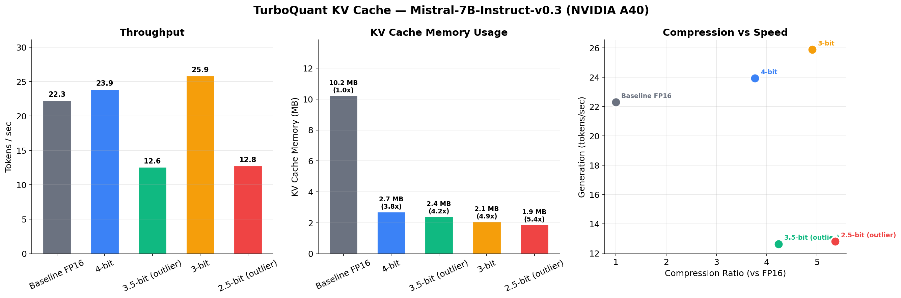
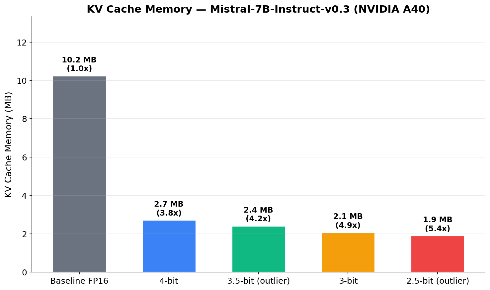
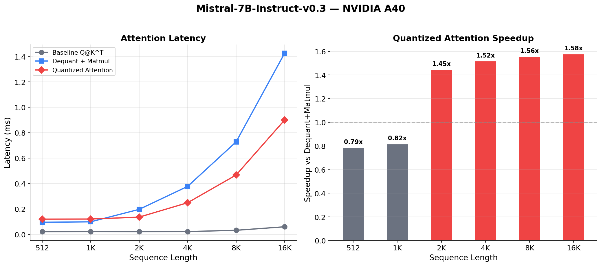
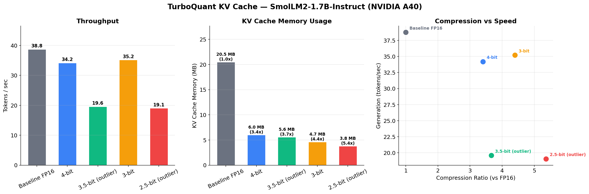

# TurboQuant

A faithful, from-scratch implementation of **TurboQuant** — the KV cache compression algorithm from Google Research that achieves **2.5–4 bit quantization with zero accuracy loss** and no training or calibration required.

> Zandieh, Daliri, Hadian, Mirrokni. *"TurboQuant: Online Vector Quantization with Near-optimal Distortion Rate"*
> ICLR 2026 — [arXiv:2504.19874](https://arxiv.org/abs/2504.19874) | [Google Research Blog](https://research.google/blog/turboquant-redefining-ai-efficiency-with-extreme-compression/)

## Key Results

### Mistral-7B-Instruct-v0.3 on NVIDIA A40



**3.8–5.4x KV cache compression** with identical generation quality at 4-bit and 3.5-bit. At 3-bit and below, minor differences appear but outputs remain coherent and correct.

### KV Cache Memory



### Quantized Attention Speedup



1.45–1.58x speedup over the naive dequantize-then-matmul approach at sequence lengths 2K–16K.

### SmolLM2-1.7B-Instruct on NVIDIA A40



### Algorithm Validation (30/30 checks pass)

All three algorithms match the paper's theoretical bounds:

| Algorithm | Bit Width | Measured MSE | Paper Upper Bound | Status |
|---|---|---|---|---|
| TurboQuantMSE | 2-bit | 0.0009 | 0.117 | PASS |
| TurboQuantMSE | 3-bit | 0.0003 | 0.030 | PASS |
| TurboQuantMSE | 4-bit | 0.0001 | 0.009 | PASS |
| TurboQuantProd (IP bias) | 2-4 bit | < 0.001 | < 0.02 | PASS |

## What's Implemented

| Component | Paper Reference | File |
|---|---|---|
| `TurboQuantMSE` | Algorithm 1 — MSE-optimal quantizer via random rotation + Lloyd-Max | `turboquant/core.py` |
| `QJL` | Definition 1 — 1-bit Quantized Johnson-Lindenstrauss transform | `turboquant/core.py` |
| `TurboQuantProd` | Algorithm 2 — Unbiased inner-product quantizer (MSE + QJL residual) | `turboquant/core.py` |
| `TurboQuantCache` | KV cache with per-channel outlier-aware quantization (Section 4.3) | `turboquant/cache.py` |
| `TQLayerFused` | Cache layer that exposes compressed indices for quantized attention | `turboquant/cache.py` |
| `QuantizedAttention` | Compute Q@K^T directly on compressed indices (no dequantize) | `turboquant/attention.py` |
| `FusedQuantizedAttentionCUDA` | Triton kernel: centroid lookup + dot product in one pass | `turboquant/cuda_kernels.py` |
| Bit-packing | Pack 2/3/4-bit indices into tightly packed bytes | `turboquant/packing.py` |

### Per-Channel Outlier-Aware Quantization (Section 4.3)

The paper's key technique for aggressive compression: within each head, the top-k channels (by RMS magnitude) are quantized at higher precision. For `head_dim=128`:
- **2.5-bit**: 32 outlier channels at 3-bit, 96 regular channels at 2-bit
- **3.5-bit**: 32 outlier channels at 4-bit, 96 regular channels at 3-bit

This is implemented as per-channel splitting (not per-head), matching the paper exactly.

## Quick Start

### Local (CPU / Apple Silicon MPS)

```bash
git clone https://github.com/OmarHory/turboquant.git
cd turboquant
python -m venv .venv && source .venv/bin/activate
pip install -r requirements.txt

python -m benchmarks.local
```

### GPU via RunPod

Spins up a GPU pod, runs everything, prints results, auto-terminates. No lingering charges.

```bash
cp .env.example .env
# Add your RunPod API key and (optional) HuggingFace token

python -m benchmarks.gpu                              # SmolLM-1.7B on A40 (default)
python -m benchmarks.gpu --model mistral-7b           # Mistral-7B on A40
python -m benchmarks.gpu --model mistral-7b --gpu a100  # Mistral-7B on A100
```

### Validate Algorithms

```bash
python -m benchmarks.validate_algorithms
```

Runs all 30 checks against the paper's theoretical bounds (MSE, inner-product error, bias, recall@k).

### Needle-In-A-Haystack Evaluation

```bash
python -m benchmarks.eval_needle --model meta-llama/Llama-3.1-8B-Instruct
```

### LongBench-E Evaluation

```bash
python -m benchmarks.eval_longbench --model meta-llama/Llama-3.1-8B-Instruct --max-samples 20
```

## How It Works

TurboQuant's core insight: random rotation transforms **any** input vector into a well-behaved distribution, enabling optimal per-coordinate scalar quantization that is provably within **2.7x of the information-theoretic lower bound**.

1. **Random Rotation** — Multiply by a random orthogonal matrix Pi. Every coordinate of the rotated vector follows a known distribution (converging to Gaussian), regardless of input data.

2. **Lloyd-Max Scalar Quantization** — Apply an optimal 1D quantizer per coordinate. The codebook is precomputed once from the known distribution — no calibration data needed.

3. **Per-Channel Outlier Separation** — For aggressive compression (2.5–3.5 bits), channels with highest RMS magnitude get more bits, preserving quality.

4. **Quantized Attention** — Instead of dequantizing keys for attention, rotate the query into quantization space and compute dot products directly via centroid lookups.

```
Quantize:   x  ──→  Pi @ x  ──→  bucketize  ──→  uint8 indices (b bits/dim)
Attention:  Q  ──→  Q @ Pi^T ──→  matmul(centroids[idx])  ──→  scores
                    (rotate once)   (no full dequantize needed)
```

## Project Structure

```
turboquant/
├── turboquant/                   # Core package
│   ├── __init__.py               # Public API
│   ├── core.py                   # TurboQuantMSE, QJL, TurboQuantProd
│   ├── cache.py                  # KV cache: TurboQuantLayer, TQLayerFused
│   ├── attention.py              # Quantized attention (skip dequantize)
│   ├── cuda_kernels.py           # Fused Triton CUDA kernels
│   └── packing.py                # Bit-packing for sub-byte indices
├── benchmarks/
│   ├── local.py                  # CPU/MPS benchmark (SmolLM-1.7B)
│   ├── gpu.py                    # RunPod GPU benchmark (multi-model)
│   ├── validate_algorithms.py    # Paper bounds validation (30 checks)
│   ├── eval_needle.py            # Needle-In-A-Haystack evaluation
│   └── eval_longbench.py         # LongBench-E evaluation
├── scripts/
│   └── generate_charts.py        # Regenerate all charts from results
├── assets/                       # Charts and figures
├── results/                      # Benchmark results (JSON)
│   ├── a40_mistral_7b.json
│   └── a40_smollm2_17b.json
├── .env.example
├── requirements.txt
├── LICENSE
└── README.md
```

## Limitations

- **Attention speedup is 1.5x, not 8x**: The paper's 8x speedup couldn't be achieved without the authors' internal kernel implementation.

- **Dense rotation matrix**: We use a full `(D, D)` random orthogonal matrix, matching the paper. Hadamard-based fast rotations are a possible optimization for `head_dim > 128`.

- **Llama-3.1-8B not tested**: The Llama-3.1-8B model requires gated access on HuggingFace. Results are from Mistral-7B-Instruct-v0.3 (same architecture class, similar parameter count).

## Citation

```bibtex
@inproceedings{zandieh2026turboquant,
  title={TurboQuant: Online Vector Quantization with Near-optimal Distortion Rate},
  author={Zandieh, Amir and Daliri, Majid and Hadian, Majid and Mirrokni, Vahab},
  booktitle={International Conference on Learning Representations (ICLR)},
  year={2026}
}
```

## License

MIT
